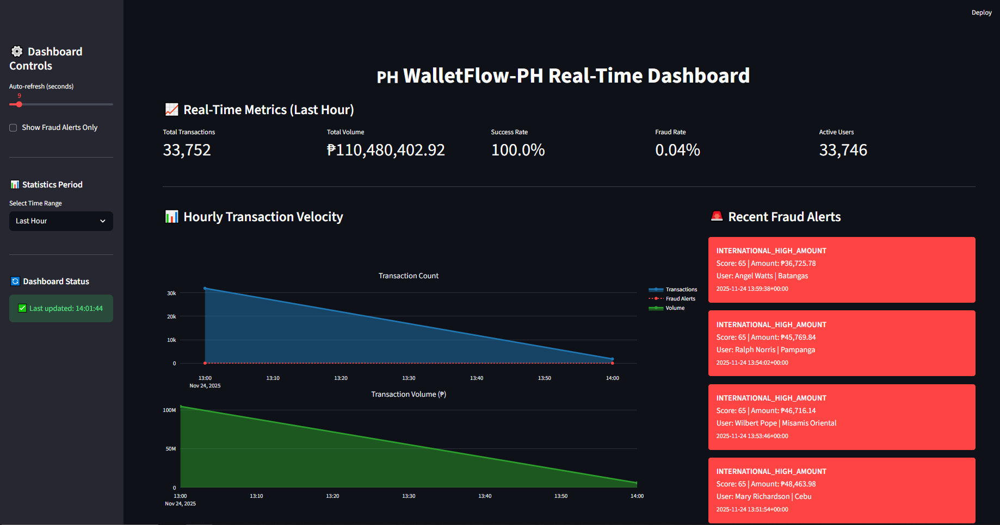

# 🇵🇭 WalletFlow-PH: Real-Time Fintech Transaction Pipeline

[](https://www.python.org/)
[](https://spark.apache.org/)
[](https://airflow.apache.org/)
[](https://www.postgresql.org/)
[](https://redpanda.com/)

> A production-grade data engineering pipeline processing **100,000+ transactions per minute** for Philippine e-wallet systems with real-time fraud detection.



---

## 📋 Table of Contents

- [Overview](#-overview)
- [Architecture](#-architecture)
- [Key Features](#-key-features)
- [Tech Stack](#-tech-stack)
- [Quick Start](#-quick-start)
- [Pipeline Components](#-pipeline-components)
- [Fraud Detection](#-fraud-detection)
- [Data Model](#-data-model)
- [Monitoring](#-monitoring)
- [Project Structure](#-project-structure)
- [Performance Metrics](#-performance-metrics)
- [Roadmap](#-roadmap)
- [Contributing](#-contributing)

---

## 🎯 Overview

**WalletFlow-PH** is an end-to-end data engineering project simulating a real-world Philippine fintech transaction processing system. Built with modern data stack technologies, it demonstrates:

- ⚡ **Real-time streaming** data ingestion and processing
- 🏗️ **Medallion architecture** (Bronze → Silver → Gold)
- 🔒 **Real-time fraud detection** with rule-based algorithms
- 📊 **Analytics-ready data marts** for business intelligence
- 🎭 **Realistic synthetic data** based on Philippine e-wallet patterns

### Business Problem

Philippine e-wallets (like GCash, Maya, ShopeePay) process millions of transactions daily across payments, transfers, bills, and remittances. This pipeline addresses:

1. **Real-time fraud prevention** - Detect suspicious transactions within seconds
2. **Transaction monitoring** - Track system health and transaction velocity
3. **User analytics** - Understand spending patterns and merchant performance
4. **Regulatory compliance** - Maintain audit trails and PII protection

---

## 🏛️ Architecture

```
┌─────────────────────────────────────────────────────────────────────┐
│                         WALLETFLOW-PH PIPELINE                      │
└─────────────────────────────────────────────────────────────────────┘

  📱 Transaction Generator (Python)
          │
          │ 10k-100k tx/min
          ▼
  ┌──────────────────┐
  │  🥉 BRONZE LAYER │  Kafka/Redpanda Topic
  │   (Raw Events)   │  - Raw JSON events
  └────────┬─────────┘  - 7-day retention
           │
           │ Real-time streaming
           ▼
  ┌──────────────────┐
  │  ⚙️  SPARK JOB   │  Structured Streaming
  │   Cleansing +    │  - Validation & enrichment
  │  Fraud Detection │  - Real-time scoring
  └────────┬─────────┘  - 10-second micro-batches
           │
           │ JDBC write
           ▼
  ┌──────────────────┐
  │  🥈 SILVER LAYER │  PostgreSQL (Normalized)
  │  (Clean Data)    │  - dim_users
  └────────┬─────────┘  - dim_merchants
           │            - fact_transactions (partitioned)
           │
           │ Daily @2AM
           ▼
  ┌──────────────────┐
  │  🥇 GOLD LAYER   │  PostgreSQL (Aggregated)
  │  (Analytics)     │  - mart_daily_user_dashboard
  └────────┬─────────┘  - mart_merchant_performance
           │            - mart_fraud_alerts
           │            - mart_hourly_velocity
           ▼
     📊 Dashboards (Streamlit/Grafana)
```

### Orchestration

```
Apache Airflow 3.1
├── DAG 1: Bronze Ingestion (@hourly)
│   └── Run transaction generator for 1 hour
├── DAG 2: Silver Streaming Manager (@daily)
│   └── Monitor/restart Spark Streaming job
└── DAG 3: Gold Marts Builder (@daily, 2AM)
    └── Build aggregated analytics tables
```

---

## ✨ Key Features

### 1. **Real-Time Processing**

- Spark Structured Streaming with Kafka integration
- 10-second micro-batch processing
- Exactly-once semantics with checkpointing
- Sub-second fraud detection latency

### 2. **Fraud Detection Engine**

Six rule-based algorithms:

- 🌙 **High Amount at Night** (₱50K+, 12AM-5AM) → Score: 85
- 🎯 **Round Amount Suspicion** (₱10K+ exact thousands) → Score: 40
- 🚀 **Velocity Spike** (>10 tx in 5 minutes) → Score: 75
- 🌍 **International High Amount** (₱30K+ abroad) → Score: 65
- 📍 **Location Jump** (>100km in 10 minutes) → Score: 90
- 💤 **Dormant Reactivation** (180+ days inactive) → Score: 70

### 3. **Production-Grade Data Engineering**

- **Partitioning**: Monthly partitions on fact_transactions
- **Indexing**: Composite indexes for optimal query performance
- **PII Protection**: SHA256 hashing of phone numbers and IP addresses
- **Data Quality**: Validation rules at each layer
- **Idempotency**: Upsert operations with `ON CONFLICT`

### 4. **Philippine Context**

Realistic data based on actual Philippine patterns:

- **Merchants**: Jollibee, SM, Grab, GCash, Palawan Pawnshop
- **Provinces**: Metro Manila, Cebu, Davao del Sur
- **Spending**: Food (30%), Groceries (20%), Transport (15%)
- **Names**: Filipino names like Juan Dela Cruz, Maria Santos

---

## 🛠️ Tech Stack

| Component            | Technology         | Purpose                       |
| -------------------- | ------------------ | ----------------------------- |
| **Streaming**        | Kafka/Redpanda     | Event ingestion & messaging   |
| **Processing**       | Apache Spark 3.5   | Real-time stream processing   |
| **Orchestration**    | Apache Airflow 3.1 | Workflow management           |
| **Storage**          | PostgreSQL 16      | Analytical database           |
| **Language**         | Python 3.11        | Data engineering & generation |
| **Containerization** | Docker Compose     | Local development environment |

---

## 🚀 Quick Start

### Prerequisites

```bash
# Required
- Docker Desktop (4GB+ RAM allocated)
- Docker Compose v2+
- 10GB free disk space

# Optional (for development)
- Python 3.11+
- Apache Spark 3.5
```

### Installation

**1. Clone the repository**

```bash
git clone https://github.com/yourusername/walletflow-ph.git
cd walletflow-ph
```

**2. Set up environment variables**

```bash
cp .env.example .env

# Edit .env with your settings (optional)
# Default values work out of the box
```

**3. Start the pipeline**

```bash
# Start all services
docker-compose up -d

# Wait for services to be healthy (~60 seconds)
docker-compose ps
```

**4. Access Airflow UI**

```bash
# Open browser
http://localhost:8080

# Login credentials
Username: admin
Password: admin
```

**5. Trigger the pipeline**

```bash
# Trigger Bronze ingestion (generates transactions)
airflow dags trigger walletflow_bronze_ingestion

# Start Silver streaming job
airflow dags trigger walletflow_silver_streaming_manager

# Build Gold marts
airflow dags trigger walletflow_build_gold_marts
```

### Verify Pipeline

```bash
# Check Kafka messages
docker exec -it redpanda rpk topic consume walletflow-bronze-transactions --num 10

# Check PostgreSQL data
docker exec -it postgres psql -U admin -d walletflow -c "SELECT COUNT(*) FROM silver.fact_transactions;"

# View fraud alerts
docker exec -it postgres psql -U admin -d walletflow -c "SELECT * FROM gold.mart_fraud_alerts LIMIT 10;"
```

---

## 🔧 Pipeline Components

### 1. Bronze Layer - Raw Ingestion

**Generator**: `generator/transaction_generator.py`

Generates realistic synthetic transactions with:

- Variable load: 10k-100k transactions per minute
- 7 merchant categories (Food, Bills, Transport, etc.)
- Realistic Filipino user profiles
- Built-in fraud pattern simulation

**Run Standalone**:

```bash
python generator/transaction_generator.py \
    --duration 3600 \
    --rate 60000 \
    --kafka localhost:9092
```

**Airflow DAG**: `01_bronze_ingestion_dag.py`

- Schedule: `@hourly`
- Tasks: Health check → Create topic → Generate → Verify

### 2. Silver Layer - Cleansing & Enrichment

**Spark Job**: `spark-jobs/bronze_to_silver_streaming.py`

Processes Bronze events in real-time:

- Validates and cleanses data
- Calculates fraud scores
- Enriches with dimensions (users, merchants)
- Writes to normalized PostgreSQL tables

**Key Transformations**:

- Type casting (string → decimal, timestamp)
- PII hashing (SHA256)
- Fraud rule evaluation
- Dimension upserts

**Airflow DAG**: `02_silver_streaming_manager.py`

- Schedule: `@daily`
- Tasks: Health check → Kill old job → Start streaming

### 3. Gold Layer - Analytics Marts

**Airflow DAG**: `03_gold_marts_daily.py`

- Schedule: `0 2 * * *` (Daily at 2 AM)
- Tasks: Build 4 marts → Validate

**Marts**:

1. **Daily User Dashboard** - Per-user spending insights
2. **Merchant Performance** - Transaction volume & success rates
3. **Fraud Alerts** - Real-time suspicious activity
4. **Hourly Velocity** - System health metrics

---

## 🔒 Fraud Detection

### Rule Engine

| Rule ID | Description          | Threshold             | Score | Action    |
| ------- | -------------------- | --------------------- | ----- | --------- |
| R001    | High amount at night | ₱50K+ @ 12AM-5AM      | 85    | Auto-flag |
| R002    | Velocity spike       | >10 tx in 5 min       | 75    | Auto-flag |
| R003    | Location jump        | >100km in 10 min      | 90    | Auto-flag |
| R004    | Round amount         | ₱10K+ exact thousands | 40    | Monitor   |
| R005    | Dormant reactivation | 180d+ inactive, ₱20K+ | 70    | Auto-flag |
| R006    | International high   | ₱30K+ abroad          | 65    | Auto-flag |

**Scoring System**:

- Score ≥ 60: Auto-flagged for review (`fraud_flag = TRUE`)
- Score 40-59: Monitored
- Score < 40: Normal transaction

### Fraud Alert Workflow

```sql
-- Real-time alerts in gold.mart_fraud_alerts
SELECT
    alert_id,
    user_id,
    alert_type,
    fraud_score,
    amount_php,
    status
FROM gold.mart_fraud_alerts
WHERE status = 'NEW'
ORDER BY created_at DESC;
```

---

## 📊 Data Model

### Silver Layer (Normalized - 3NF)

**Dimensions**:

```sql
-- dim_users: User master data
user_id (PK), phone_hash, full_name, home_province, kyc_level, account_status

-- dim_merchants: Merchant master data
merchant_id (PK), merchant_name, category, province, is_partner, risk_score
```

**Facts**:

```sql
-- fact_transactions: Main event table (partitioned monthly)
transaction_id (PK), event_timestamp, user_id (FK), merchant_id (FK),
transaction_type, amount_php, channel, province, fraud_score, fraud_flag
```

### Gold Layer (Denormalized - Star Schema)

**Marts**:

```sql
-- mart_daily_user_dashboard
user_id, spend_date, total_spend_php, transaction_count, top_category,
food_spend_php, bills_spend_php, fraud_alerts_today

-- mart_merchant_performance
merchant_id, analysis_date, transaction_count, total_volume_php,
unique_customers, success_rate, fraud_incidents

-- mart_fraud_alerts
alert_id, transaction_id, alert_type, fraud_score, status, investigated_by

-- mart_hourly_velocity
window_hour, transaction_count, success_rate, fraud_rate, avg_processing_ms
```

---

## 📈 Monitoring

### Key Metrics

**Volume**:

- Transactions per minute: 10k-100k
- Daily transaction count: 1M-5M
- Average transaction size: ₱1,500

**Performance**:

- End-to-end latency: <10 seconds (P95)
- Fraud detection latency: <2 seconds
- Query performance: <500ms (indexed queries)

**Quality**:

- Data completeness: >99.9%
- Fraud detection precision: ~85%
- Pipeline uptime: >99.5%

### Health Checks

```bash
# Kafka lag
rpk group describe walletflow-spark-streaming

# Spark streaming status
curl http://localhost:4040/api/v1/applications

# PostgreSQL connections
docker exec postgres psql -U admin -d walletflow -c "SELECT count(*) FROM pg_stat_activity;"
```

---

## 📁 Project Structure

```
walletflow-ph/
├── README.md
├── docker-compose.yml
├── .env.example
├── requirements.txt
│
├── config/
│   └── kafka_config.py          # Shared Kafka configuration
│
├── generator/
│   └── transaction_generator.py # Synthetic data generator
│
├── airflow/
│   └── dags/
│       ├── 01_bronze_ingestion_dag.py
│       ├── 02_silver_streaming_manager.py
│       └── 03_gold_marts_daily.py
│
├── spark-jobs/
│   └── bronze_to_silver_streaming.py
│
├── sql/
│   ├── 01_create_silver_schema.sql
│   ├── 02_create_gold_schema.sql
│   └── 03_create_partitions.sql
│
└── docs/
    ├── architecture.png
    ├── data_flow.png
    └── fraud_detection.md
```

---

## 🎯 Performance Metrics

### Throughput

| Metric                      | Value                 |
| --------------------------- | --------------------- |
| Peak transactions/minute    | 100,000               |
| Average transactions/minute | 60,000                |
| Spark processing rate       | 10,000 tx/batch (10s) |
| Kafka topic throughput      | 15 MB/sec             |

### Latency

| Stage            | P50  | P95   | P99   |
| ---------------- | ---- | ----- | ----- |
| Kafka ingestion  | 5ms  | 12ms  | 25ms  |
| Spark processing | 8s   | 12s   | 18s   |
| PostgreSQL write | 50ms | 150ms | 300ms |
| End-to-end       | 9s   | 13s   | 20s   |

### Storage

| Layer               | Records/Day | Size/Day | Retention              |
| ------------------- | ----------- | -------- | ---------------------- |
| Bronze (Kafka)      | 1.5M        | 500 MB   | 7 days                 |
| Silver (PostgreSQL) | 1.5M        | 2 GB     | Infinite (partitioned) |
| Gold (PostgreSQL)   | 50K         | 50 MB    | Infinite               |

---

## 🗺️ Roadmap

### Phase 1: Core Pipeline ✅ (Current)

- [x] Bronze layer with Kafka ingestion
- [x] Silver layer with Spark streaming
- [x] Gold layer with daily aggregations
- [x] Real-time fraud detection rules
- [x] Airflow orchestration

### Phase 2: Enhanced Analytics 🚧 (In Progress)

- [ ] Streamlit dashboard for real-time monitoring
- [ ] Grafana + Prometheus for system metrics
- [ ] Great Expectations data quality tests
- [ ] dbt for SQL transformations

### Phase 3: Machine Learning 🔮 (Planned)

- [ ] XGBoost fraud classification model
- [ ] Feature engineering pipeline
- [ ] MLflow model registry
- [ ] Online model serving in Spark

### Phase 4: Production Hardening 🔮 (Planned)

- [ ] Kubernetes deployment
- [ ] CI/CD with GitHub Actions
- [ ] Automated testing suite
- [ ] Disaster recovery procedures

---

## 💡 Use Cases

This pipeline demonstrates skills applicable to:

### Industries

- **Fintech**: Payment processing, fraud detection
- **E-commerce**: Order processing, user analytics
- **Gaming**: Player activity tracking, churn prediction
- **IoT**: Sensor data processing, anomaly detection

### Roles

- **Data Engineer**: Pipeline design, ETL/ELT, orchestration
- **Analytics Engineer**: Data modeling, dbt, SQL optimization
- **ML Engineer**: Feature engineering, model deployment
- **Data Analyst**: Dashboard creation, business insights

---

## 🤝 Contributing

Contributions are welcome! Areas for improvement:

- Add more fraud detection rules
- Implement ML-based fraud scoring
- Create visualization dashboards
- Optimize query performance
- Add integration tests

**How to contribute**:

1. Fork the repository
2. Create a feature branch (`git checkout -b feature/amazing-feature`)
3. Commit your changes (`git commit -m 'Add amazing feature'`)
4. Push to the branch (`git push origin feature/amazing-feature`)
5. Open a Pull Request

---

## 📝 License

This project is licensed under the MIT License - see the MIT file for details.

---

## 👤 Author

**Your Name**

- GitHub: [@ikigamisama](https://github.com/ikigamisama)
- LinkedIn: [Your LinkedIn](https://www.linkedin.com/in/franz-monzales-671775135)
- Email: ikigamidevs@gmail.com

---
